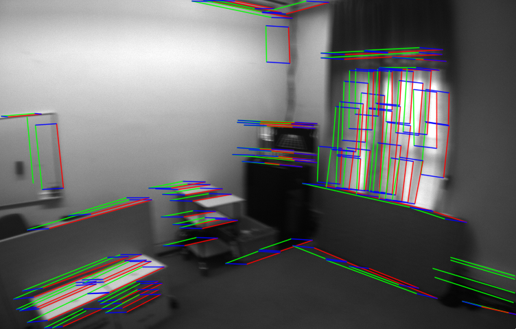

# Line Tracker
Line track using optical flow.
This is an unofficial implementation of line optical flow, more details can be found in "EPLF-VINS: Real-Time Monocular Visual-Inertial SLAM With Efficient Point-Line Flow Features".

## Optimize
The codes use ZNCC match to decide that those lines are tracing fail.

<figure class="half">
    
</figure>
The previous lines are green, and the next lines are red (left without ZNCC, right with ZNCC).

## Usage
1. Dependencies that need to be installed on your system:
- [OpenCV4](https://opencv.org/)
- [GLog](https://github.com/google/glog)
- [Eigen3](https://eigen.tuxfamily.org/index.php?title=Main_Page)
```shell
sudo apt install libgoogle-glog-dev
sudo apt install libeigen3-dev
```
2. Build the codes
```shell
mkdir build && cd build
cmake ..
make
```

3. Run the demo
```shell
./build/test_line_tracker asset/prev.png asset/next.png
```


